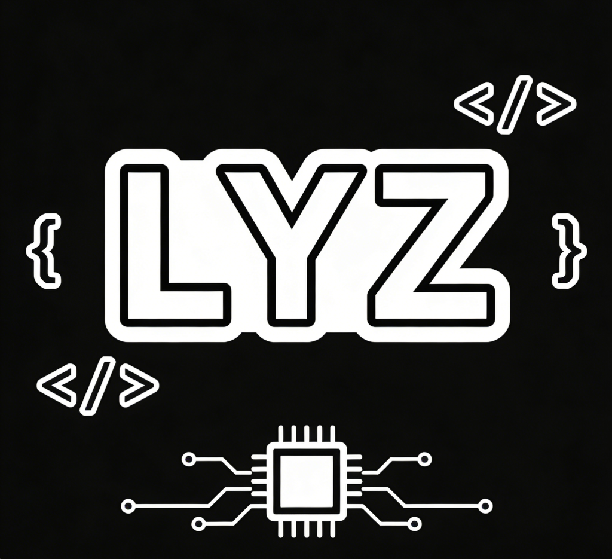

# LYZ
Software Engineering Team：Lv Yifan(吕逸凡）,Yang Chuting(杨楚婷),Zhang Xinyan(张鑫艳)

# 团队logo

**设计理念**

* 字母设计：
使用简洁而现代的无衬线字体，确保“LYZ”字母清晰可见。可以将字母部分做成连体设计，增强整体性。

* 黑白配色：
使用黑色作为基底色，字母可以用白色来突出显示。也可以考虑在字母旁边添加一个黑色边框来增强对比。

* 软件工程元素：
在字母旁边或底部可以加入一些编程相关的元素，比如：小的代码符号，如 {} 或 </>。一个简单的电路或芯片图案，以象征技术与软件。

* 布局建议：
你可以将“LYZ”字母居中放置，软件工程元素可以围绕字母，形成一个和谐的整体。另一个选择是将字母放置于顶部，软件元素作为底部装饰，提升深度感

**生成理念**

* 基于原有想法交于AI工具进行文字渲染，在此基础上加以修改提交给AI生成图片。
